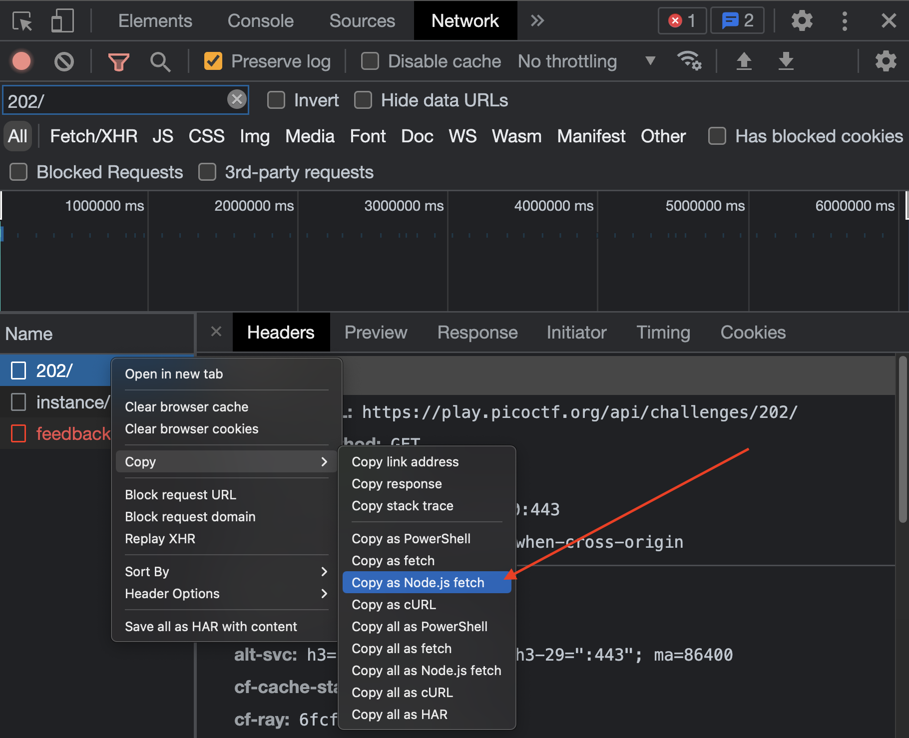
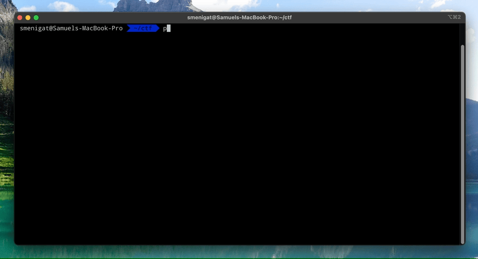

## picoctf-dl

Makes it easy to set up a local directory for a [PicoCTF](https://picoctf.org/) challenge.

You need `nodejs` and `yarn` installed as prerequisites.

### Setup

```bash
## clone this repo first
git clone git@github.com:SMenigat/picoctf-dl.git

## switch into
cd picoctf-dl

## install dependencies
yarn

## create a config.js file within this folder containing
## the extracted http-header information (see guide on how to extract that)
echo "const HEADERS = {}; module.exports = { HEADERS };" > config.js

## now open your bash profile and add a alias to this app to it
echo "alias picoctf-dl=\"<path-to-dir>/picoctf-dl.js\"" >> ~/.zshrc
```

### Extract Header

When in GoogleCrome, log into the PicoCTF Platform. Open the network tab of the browser console. Then click on any of the challenges.

Find the corresponding request in the request list and copy the request data as `Node.js fetch`.



This will copy something like that into your clipboard:

```JavaScript
fetch("https://play.picoctf.org/api/challenges/202/", {
  "headers": {
    "accept": "application/json, text/plain, */*",
    "accept-language": "en-US,en;q=0.9,de-DE;q=0.8,de;q=0.7,fil;q=0.6",
    "sec-ch-ua": "\" Not A;Brand\";v=\"99\", \"Chromium\";v=\"100\", \"Google Chrome\";v=\"100\"",
    "sec-ch-ua-mobile": "?0",
    "sec-ch-ua-platform": "\"macOS\"",
    "sec-fetch-dest": "empty",
    "sec-fetch-mode": "cors",
    "sec-fetch-site": "same-origin",
    "x-csrftoken": "<TOKEN>",
    "cookie": "_ga=GA1.2.1608556337.1650010417; csrftoken=<TOKEN>; sessionid=<SESSID>; _gid=GA1.2.131558942.1650134071; _gat=1",
    "Referer": "https://play.picoctf.org/practice/challenge/202?category=1&page=1&solved=1",
    "Referrer-Policy": "strict-origin-when-cross-origin"
  },
  "body": null,
  "method": "GET"
});
```

Now copy the options out of `headers` into your `config.js` file, so that it looks like that in the end:

```JavaScript
// <repo-dir>/config.js
const HEADERS = {
    "accept": "application/json, text/plain, */*",
    "accept-language": "en-US,en;q=0.9,de-DE;q=0.8,de;q=0.7,fil;q=0.6",
    "sec-ch-ua": "\" Not A;Brand\";v=\"99\", \"Chromium\";v=\"100\", \"Google Chrome\";v=\"100\"",
    "sec-ch-ua-mobile": "?0",
    "sec-ch-ua-platform": "\"macOS\"",
    "sec-fetch-dest": "empty",
    "sec-fetch-mode": "cors",
    "sec-fetch-site": "same-origin",
    "x-csrftoken": "<TOKEN>",
    "cookie": "_ga=GA1.2.1608556337.1650010417; csrftoken=<TOKEN>; sessionid=<SESSID>; _gid=GA1.2.131558942.1650134071; _gat=1",
    "Referer": "https://play.picoctf.org/practice/challenge/202?category=1&page=1&solved=1",
    "Referrer-Policy": "strict-origin-when-cross-origin"
};

module.exports = {
  HEADERS,
};
```

After that you are ready to use the downloader for your session.

### Usage

```bash
## run downloader
picoctf-dl 202

## this will download all infos into a new folder with the challenge name
cd caas

## you can now read the description via the readme.md
less readme.md
```

### Demo


